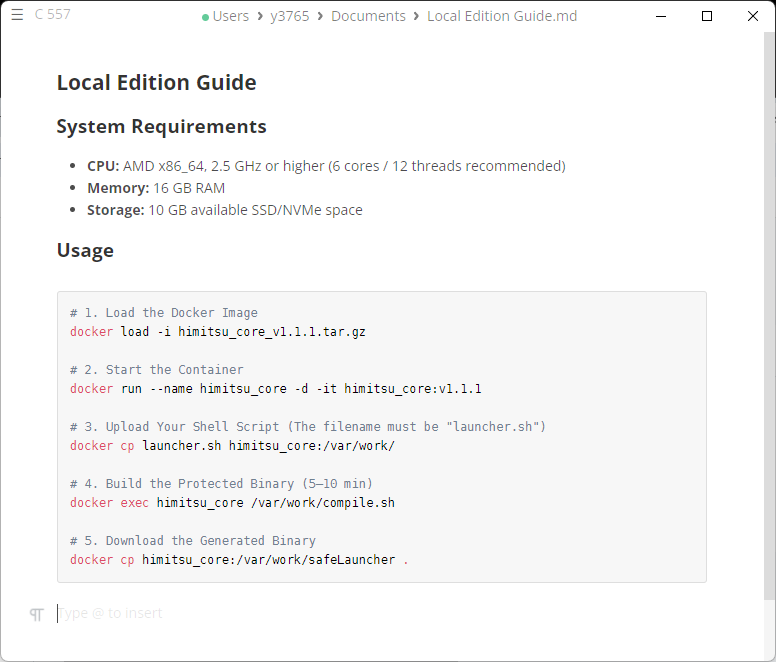

<p align="center">
  <a href="https://himitsushell.com/" target="blank"></a>
</p>
<p align="center">
  
  
  <a href="https://github.com/HimitsuShell/Himitsu/releases">
    
  </a>
</p>

## HimitsuShell


[HimitsuShell](https://himitsushell.com) converts shell scripts into obfuscated binaries using an embedded shell interpreter and anti-debugging protections. (alternative to shc)

### Features
<table border="1">
  <tr>
    <td width=50%>
      
      <br/>
      <b>OS-Level Logging & Hooking Protection</b>
      <br/>
      Embeds its own shell interpreter, eliminating reliance on the system shell and reducing exposure to OS-level logging and hooking. (e.g., auditd).
    </td>
    <td width=50%>
      
      <br/>
      <b>String & Constant Encryption</b>
      <br/>
      All strings and constants in the binary are encrypted, making static analysis more difficult (e.g., IDA, Ghidra).
    </td>
  </tr>
  <tr>
    <td width=50%>
      
      <br/>
      <b>Debugger Detection</b>
      <br/>
      Continuously detects debuggers during execution, making dynamic analysis more difficult (e.g., gdb, ptrace, strace).
    </td>
    <td width=50%>
      
      <br/>
      <b>Advanced Obfuscation Techniques</b>
      <br/>
      Features instruction substitution, indirect calls, indirect branches, basic block splitting, and bogus control flow.
    </td>
  </tr>
  <tr>
    <td width=50%>
      
      <br/>
      <b>Simple Local Edition Usage</b>
      <br/>
      Use the Local Edition with just a few commands.
    </td>
    <td width=50%>
      
      <br/>
      <b>License Verification (Planned)</b>
      <br/>
      Restricts shell script execution to users with a valid license key.
    </td>
  </tr>
</table>

### Compared to shc
| | HimitsuShell | shc |
|-|-|-|
| OS-Level Logging & Hooking Protection | ✓ | |
| Dynamic Library Hooking Protection | ✓ | |
| String & Constant Encryption | ✓ | |
| Debugger Detection | ✓ | ✓ |
| Advanced Obfuscation Techniques | ✓ | |

### Usage on the Web


## Local Edition Guide
### System Requirements
- **CPU:** AMD x86_64, 2.5 GHz or higher (6 cores / 12 threads recommended)
- **Memory:** 16 GB RAM
- **Storage:** 10 GB available SSD/NVMe space

### Usage
```shell
# 1. Load the Docker Image
docker load -i himitsu_core_v1.1.2.tar.gz

# 2. Start the Container
docker run --name himitsu_core -d -it himitsu_core:v1.1.2

# 3. Upload Your Shell Script (The filename must be "launcher.sh")
docker cp launcher.sh himitsu_core:/var/work/

# 4. Build the Protected Binary (10–20 min)
docker exec himitsu_core /var/work/compile.sh

# 5. Download the Generated Binary
docker cp himitsu_core:/var/work/safeLauncher .
```

## About This Repository
HimitsuShell is a commercial software product.

This repository does not contain the HimitsuShell source code.

It serves as the official community hub for:

- Discussions
- Bug reports
- Feature requests

## Research & Security Analysis
- [Shell Script Obfuscator Comparison: Bashfuscator vs. HimitsuShell](https://medium.com/@y37653/shell-script-obfuscator-comparison-bashfuscator-vs-himitsushell-6075fb19f657)
- [Shell Script-to-Binary Tools: shc vs. HimitsuShell](https://medium.com/@y37653/shell-script-to-binary-tools-shc-vs-himitsushell-31baed264c6f)
- [shc Security Analysis: Structural Limitations of a Shell Script Compiler](https://medium.com/@y37653/how-to-hack-shc-shell-script-protection-tool-bd958126ea66)
- [ssc Security Analysis: Structural Limitations of a Shell Script Compiler](https://medium.com/@y37653/how-to-hack-ssc-shell-script-protection-tool-90a34b13c802)

## Discussions
We welcome questions, feedback, bug reports, feature requests, and use cases related to HimitsuShell. Feel free to start a discussion and share your thoughts.

## Contact
hjyun@mushsw.com
